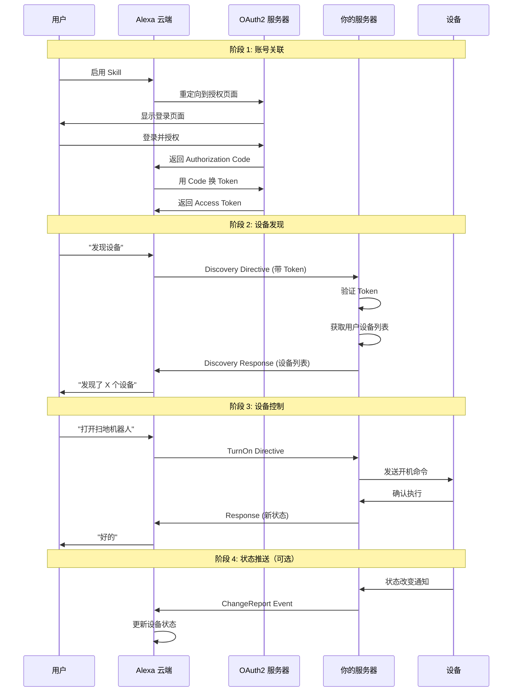
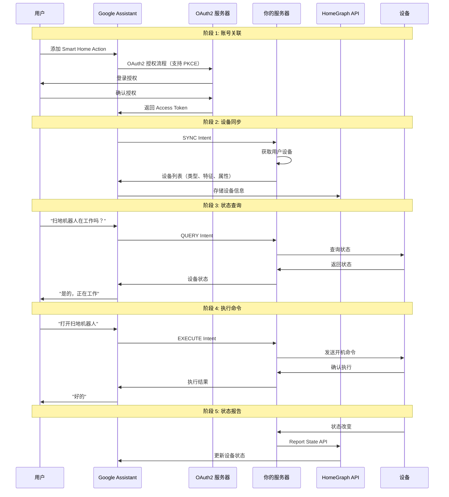
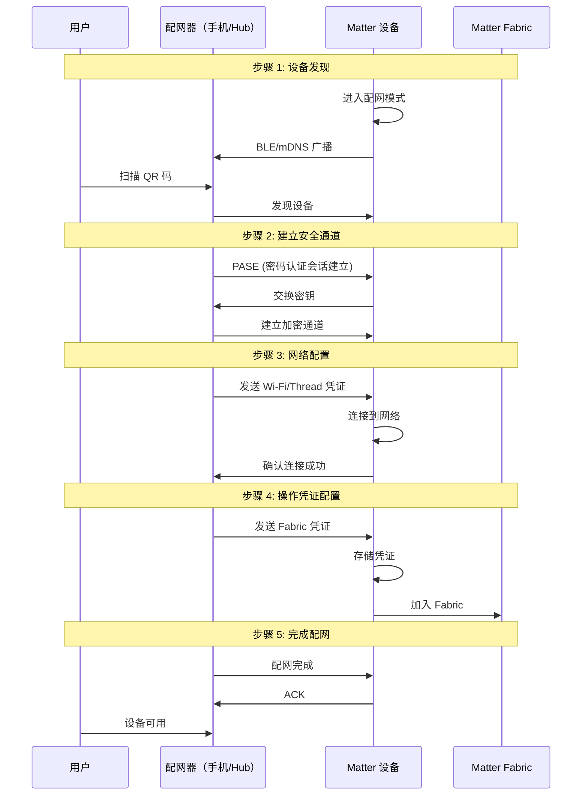

# Amazon Alexa、Google Assistant 和 Matter 对接流程深度分析

> 基于 Home Assistant Core 项目源码分析

## 📋 目录

1. [Amazon Alexa Smart Home Skill 对接流程](#1-amazon-alexa-smart-home-skill-对接流程)
2. [Google Assistant Smart Home Action 对接流程](#2-google-assistant-smart-home-action-对接流程)
3. [Matter 协议对接流程](#3-matter-协议对接流程)
4. [三大平台对比分析](#4-三大平台对比分析)
5. [Home Assistant 实现分析](#5-home-assistant-实现分析)
6. [对你的项目的启示](#6-对你的项目的启示)

---

## 1. Amazon Alexa Smart Home Skill 对接流程

### 1.1 整体架构

```
用户语音命令
    ↓
Amazon Echo 设备
    ↓
Alexa 云端服务
    ↓
Smart Home Skill (Lambda 或 HTTP Endpoint)
    ↓
OAuth2 认证
    ↓
你的服务器 (Home Assistant / 你的 Spring Boot 应用)
    ↓
设备控制
    ↓
返回响应
    ↓
Alexa 语音反馈
```

### 1.2 核心概念

#### 1.2.1 Alexa Smart Home Skill API v3

**关键组件**：
- **Directive（指令）**：Alexa 发送给你的服务器的请求
- **Event（事件）**：你的服务器返回给 Alexa 的响应
- **Endpoint（端点）**：代表一个智能设备
- **Capability（能力）**：设备支持的功能接口
- **Property（属性）**：设备的状态属性

#### 1.2.2 主要 Capability Interfaces

| Interface | 功能 | 示例 |
|-----------|------|------|
| `Alexa.Discovery` | 设备发现 | 发现用户的所有设备 |
| `Alexa.PowerController` | 电源控制 | 开/关设备 |
| `Alexa.BrightnessController` | 亮度控制 | 调节灯光亮度 |
| `Alexa.ColorController` | 颜色控制 | 改变灯光颜色 |
| `Alexa.ThermostatController` | 温控器控制 | 设置温度 |
| `Alexa.LockController` | 锁控制 | 锁定/解锁 |
| `Alexa.ModeController` | 模式控制 | 切换工作模式 |
| `Alexa.RangeController` | 范围控制 | 调节风扇速度 |

### 1.3 详细对接流程

#### 阶段 1：账号关联（Account Linking）

**流程图**：
```
用户在 Alexa App 中启用 Skill
    ↓
Alexa 重定向到你的 OAuth2 授权页面
    ↓
用户登录并授权
    ↓
你的服务器生成 Authorization Code
    ↓
重定向回 Alexa（带 code）
    ↓
Alexa 用 code 换取 Access Token
    ↓
Alexa 存储 Access Token
    ↓
账号关联完成
```

**OAuth2 配置要求**：

- **Authorization URL**：用户授权页面
- **Token URL**：获取 Access Token 的端点
- **Client ID** 和 **Client Secret**：Skill 的凭证
- **Redirect URIs**：Alexa 的回调地址
- **Scope**：权限范围

**关键代码（你的项目）**：
```java
// OAuth2AuthorizationController.java
@GetMapping("/oauth2/authorize")
public String authorize(
    @RequestParam String client_id,
    @RequestParam String redirect_uri,
    @RequestParam String state,
    @RequestParam(required = false) String code_challenge,
    @RequestParam(required = false) String code_challenge_method
) {
    // 1. 验证 client_id
    // 2. 显示登录页面
    // 3. 用户授权后生成 code
    // 4. 重定向到 redirect_uri?code=xxx&state=xxx
}

@PostMapping("/oauth2/token")
public TokenResponse token(
    @RequestParam String grant_type,
    @RequestParam(required = false) String code,
    @RequestParam String client_id,
    @RequestParam String client_secret
) {
    // 1. 验证 client_id 和 client_secret
    // 2. 验证 code（如果是 authorization_code）
    // 3. 生成 access_token 和 refresh_token
    // 4. 返回 token 响应
}
```

#### 阶段 2：设备发现（Discovery）

**Alexa 请求示例**：
```json
{
  "directive": {
    "header": {
      "namespace": "Alexa.Discovery",
      "name": "Discover",
      "payloadVersion": "3",
      "messageId": "abc-123-def-456"
    },
    "payload": {
      "scope": {
        "type": "BearerToken",
        "token": "access-token-from-oauth"
      }
    }
  }
}
```

**你的服务器响应示例**：
```json
{
  "event": {
    "header": {
      "namespace": "Alexa.Discovery",
      "name": "Discover.Response",
      "payloadVersion": "3",
      "messageId": "response-message-id"
    },
    "payload": {
      "endpoints": [
        {
          "endpointId": "robot_001",
          "manufacturerName": "Your Company",
          "friendlyName": "客厅扫地机器人",
          "description": "扫地机器人",
          "displayCategories": ["VACUUM_CLEANER"],
          "capabilities": [
            {
              "type": "AlexaInterface",
              "interface": "Alexa.PowerController",
              "version": "3",
              "properties": {
                "supported": [{"name": "powerState"}],
                "proactivelyReported": true,
                "retrievable": true
              }
            },
            {
              "type": "AlexaInterface",
              "interface": "Alexa.ModeController",
              "version": "3",
              "instance": "VacuumMode",
              "properties": {
                "supported": [{"name": "mode"}],
                "proactivelyReported": true,
                "retrievable": true
              },
              "capabilityResources": {
                "friendlyNames": [
                  {"@type": "text", "value": {"text": "Mode", "locale": "en-US"}}
                ]
              },
              "configuration": {
                "ordered": false,
                "supportedModes": [
                  {
                    "value": "auto",
                    "modeResources": {
                      "friendlyNames": [
                        {"@type": "text", "value": {"text": "Auto", "locale": "en-US"}}
                      ]
                    }
                  },
                  {
                    "value": "spot",
                    "modeResources": {
                      "friendlyNames": [
                        {"@type": "text", "value": {"text": "Spot", "locale": "en-US"}}
                      ]
                    }
                  }
                ]
              }
            }
          ]
        }
      ]
    }
  }
}
```

**关键代码（Home Assistant）**：
```python
# homeassistant/components/alexa/smart_home.py

async def async_api_discovery(hass, config, request):
    """处理设备发现请求"""
    token = request["directive"]["payload"]["scope"]["token"]
    
    # 验证 token
    user_id = await validate_token(token)
    
    # 获取用户的所有设备
    entities = get_exposed_entities(hass, config)
    
    endpoints = []
    for entity in entities:
        # 为每个实体创建 endpoint
        endpoint = {
            "endpointId": entity.entity_id,
            "friendlyName": entity.attributes.get("friendly_name"),
            "displayCategories": get_display_categories(entity),
            "capabilities": get_capabilities(entity)
        }
        endpoints.append(endpoint)
    
    return {
        "event": {
            "header": {
                "namespace": "Alexa.Discovery",
                "name": "Discover.Response",
                "payloadVersion": "3",
                "messageId": generate_message_id()
            },
            "payload": {"endpoints": endpoints}
        }
    }
```

#### 阶段 3：设备控制（Control）

**场景：用户说 "Alexa, turn on the robot cleaner"**

**Alexa 请求示例**：
```json
{
  "directive": {
    "header": {
      "namespace": "Alexa.PowerController",
      "name": "TurnOn",
      "payloadVersion": "3",
      "messageId": "message-id",
      "correlationToken": "correlation-token"
    },
    "endpoint": {
      "scope": {
        "type": "BearerToken",
        "token": "access-token"
      },
      "endpointId": "robot_001",
      "cookie": {}
    },
    "payload": {}
  }
}
```

**你的服务器响应示例**：
```json
{
  "event": {
    "header": {
      "namespace": "Alexa",
      "name": "Response",
      "payloadVersion": "3",
      "messageId": "response-message-id",
      "correlationToken": "correlation-token"
    },
    "endpoint": {
      "endpointId": "robot_001"
    },
    "payload": {}
  },
  "context": {
    "properties": [
      {
        "namespace": "Alexa.PowerController",
        "name": "powerState",
        "value": "ON",
        "timeOfSample": "2026-02-25T10:30:00Z",
        "uncertaintyInMilliseconds": 500
      }
    ]
  }
}
```

**关键代码（你的项目）**：
```java
// AlexaController.java
@PostMapping("/alexa")
public ResponseEntity<?> handleDirective(@RequestBody AlexaRequest request) {
    String namespace = request.getDirective().getHeader().getNamespace();
    String name = request.getDirective().getHeader().getName();
    
    // 验证 token
    String token = request.getDirective().getEndpoint().getScope().getToken();
    if (!oauthService.validateAccessToken(token)) {
        return ResponseEntity.status(401).body(errorResponse("INVALID_TOKEN"));
    }
    
    // 路由到对应的处理器
    if ("Alexa.Discovery".equals(namespace)) {
        return handleDiscovery(request);
    } else if ("Alexa.PowerController".equals(namespace)) {
        return handlePowerControl(request);
    } else if ("Alexa.ModeController".equals(namespace)) {
        return handleModeControl(request);
    }
    
    return ResponseEntity.ok(errorResponse("INVALID_DIRECTIVE"));
}
```

#### 阶段 4：状态报告（State Reporting）

**主动状态推送（Proactive State Updates）**：

当设备状态改变时，你的服务器可以主动推送状态到 Alexa：

```json
{
  "event": {
    "header": {
      "namespace": "Alexa",
      "name": "ChangeReport",
      "payloadVersion": "3",
      "messageId": "message-id"
    },
    "endpoint": {
      "scope": {
        "type": "BearerToken",
        "token": "Alexa-access-token"
      },
      "endpointId": "robot_001"
    },
    "payload": {
      "change": {
        "cause": {
          "type": "PHYSICAL_INTERACTION"
        },
        "properties": [
          {
            "namespace": "Alexa.PowerController",
            "name": "powerState",
            "value": "OFF",
            "timeOfSample": "2026-02-25T10:35:00Z",
            "uncertaintyInMilliseconds": 500
          }
        ]
      }
    }
  }
}
```

**发送到**：`https://api.amazonalexa.com/v3/events`

### 1.4 Alexa 对接流程总结



---

## 2. Google Assistant Smart Home Action 对接流程

### 2.1 整体架构

```
用户语音命令
    ↓
Google Home / 手机
    ↓
Google Assistant 云端
    ↓
Smart Home Action (Fulfillment Webhook)
    ↓
OAuth2 认证
    ↓
你的服务器 (Home Assistant / 你的 Spring Boot 应用)
    ↓
设备控制
    ↓
返回响应
    ↓
Google Assistant 语音反馈
```

### 2.2 核心概念

#### 2.2.1 Google Smart Home Intents

| Intent | 功能 | 触发时机 |
|--------|------|---------|
| `action.devices.SYNC` | 设备同步 | 账号关联、手动同步、Request Sync |
| `action.devices.QUERY` | 状态查询 | 查询设备状态 |
| `action.devices.EXECUTE` | 执行命令 | 控制设备 |
| `action.devices.DISCONNECT` | 断开连接 | 取消账号关联 |

#### 2.2.2 Device Types 和 Traits

**Device Types（设备类型）**：
- `action.devices.types.LIGHT` - 灯光
- `action.devices.types.SWITCH` - 开关
- `action.devices.types.THERMOSTAT` - 温控器
- `action.devices.types.VACUUM` - 扫地机器人
- `action.devices.types.LOCK` - 锁

**Traits（特征）**：
- `action.devices.traits.OnOff` - 开关
- `action.devices.traits.Brightness` - 亮度
- `action.devices.traits.ColorSetting` - 颜色设置
- `action.devices.traits.TemperatureSetting` - 温度设置
- `action.devices.traits.Modes` - 模式
- `action.devices.traits.StartStop` - 启动/停止
- `action.devices.traits.Dock` - 停靠

### 2.3 详细对接流程

#### 阶段 1：账号关联（Account Linking）

与 Alexa 类似，使用 OAuth2 Authorization Code Flow。

**Google 特殊要求**：
- 支持 PKCE（Proof Key for Code Exchange）
- Token 必须是 JWT 或 Opaque Token
- 必须提供 Token Info Endpoint（可选但推荐）

#### 阶段 2：设备同步（SYNC Intent）

**Google 请求示例**：
```json
{
  "requestId": "ff36a3cc-ec34-11e6-b1a0-64510650abcf",
  "inputs": [
    {
      "intent": "action.devices.SYNC"
    }
  ]
}
```

**你的服务器响应示例**：
```json
{
  "requestId": "ff36a3cc-ec34-11e6-b1a0-64510650abcf",
  "payload": {
    "agentUserId": "user123",
    "devices": [
      {
        "id": "robot_001",
        "type": "action.devices.types.VACUUM",
        "traits": [
          "action.devices.traits.OnOff",
          "action.devices.traits.StartStop",
          "action.devices.traits.Dock",
          "action.devices.traits.Modes"
        ],
        "name": {
          "defaultNames": ["扫地机器人"],
          "name": "客厅扫地机器人",
          "nicknames": ["扫地机", "机器人"]
        },
        "willReportState": true,
        "roomHint": "客厅",
        "deviceInfo": {
          "manufacturer": "Your Company",
          "model": "Robot-V1",
          "hwVersion": "1.0",
          "swVersion": "2.0"
        },
        "attributes": {
          "availableModes": [
            {
              "name": "mode",
              "name_values": [
                {
                  "name_synonym": ["模式", "mode"],
                  "lang": "zh"
                }
              ],
              "settings": [
                {
                  "setting_name": "auto",
                  "setting_values": [
                    {
                      "setting_synonym": ["自动", "auto"],
                      "lang": "zh"
                    }
                  ]
                },
                {
                  "setting_name": "spot",
                  "setting_values": [
                    {
                      "setting_synonym": ["定点", "spot"],
                      "lang": "zh"
                    }
                  ]
                }
              ],
              "ordered": false
            }
          ]
        }
      }
    ]
  }
}
```

**关键代码（Home Assistant）**：
```python
# homeassistant/components/google_assistant/smart_home.py

async def async_devices_sync(hass, config):
    """处理 SYNC intent"""
    agent_user_id = config.get("agent_user_id")
    
    entities = get_exposed_entities(hass, config)
    devices = []
    
    for entity in entities:
        device = {
            "id": entity.entity_id,
            "type": get_device_type(entity),
            "traits": get_traits(entity),
            "name": {
                "name": entity.attributes.get("friendly_name"),
                "defaultNames": [entity.name],
                "nicknames": entity.attributes.get("aliases", [])
            },
            "willReportState": config.get("report_state", False),
            "attributes": get_attributes(entity)
        }
        
        # 添加房间信息
        if entity.attributes.get("room"):
            device["roomHint"] = entity.attributes["room"]
        
        devices.append(device)
    
    return {
        "requestId": request_id,
        "payload": {
            "agentUserId": agent_user_id,
            "devices": devices
        }
    }
```

#### 阶段 3：状态查询（QUERY Intent）

**Google 请求示例**：
```json
{
  "requestId": "ff36a3cc-ec34-11e6-b1a0-64510650abcf",
  "inputs": [
    {
      "intent": "action.devices.QUERY",
      "payload": {
        "devices": [
          {
            "id": "robot_001"
          }
        ]
      }
    }
  ]
}
```

**你的服务器响应示例**：
```json
{
  "requestId": "ff36a3cc-ec34-11e6-b1a0-64510650abcf",
  "payload": {
    "devices": {
      "robot_001": {
        "online": true,
        "status": "SUCCESS",
        "on": true,
        "isRunning": true,
        "isPaused": false,
        "currentModeSettings": {
          "mode": "auto"
        }
      }
    }
  }
}
```

#### 阶段 4：执行命令（EXECUTE Intent）

**场景：用户说 "Hey Google, turn on the robot cleaner"**

**Google 请求示例**：
```json
{
  "requestId": "ff36a3cc-ec34-11e6-b1a0-64510650abcf",
  "inputs": [
    {
      "intent": "action.devices.EXECUTE",
      "payload": {
        "commands": [
          {
            "devices": [
              {
                "id": "robot_001"
              }
            ],
            "execution": [
              {
                "command": "action.devices.commands.OnOff",
                "params": {
                  "on": true
                }
              }
            ]
          }
        ]
      }
    }
  ]
}
```

**你的服务器响应示例**：
```json
{
  "requestId": "ff36a3cc-ec34-11e6-b1a0-64510650abcf",
  "payload": {
    "commands": [
      {
        "ids": ["robot_001"],
        "status": "SUCCESS",
        "states": {
          "online": true,
          "on": true
        }
      }
    ]
  }
}
```

**关键代码（你的项目）**：
```java
// GoogleFulfillmentController.java
@PostMapping("/google/fulfillment")
public ResponseEntity<?> handleIntent(@RequestBody GoogleRequest request) {
    String intent = request.getInputs().get(0).getIntent();
    
    // 验证 token（从 header 获取）
    String token = extractToken(request);
    if (!oauthService.validateAccessToken(token)) {
        return ResponseEntity.status(401).body(errorResponse());
    }
    
    switch (intent) {
        case "action.devices.SYNC":
            return handleSync(request);
        case "action.devices.QUERY":
            return handleQuery(request);
        case "action.devices.EXECUTE":
            return handleExecute(request);
        case "action.devices.DISCONNECT":
            return handleDisconnect(request);
        default:
            return ResponseEntity.badRequest().body(errorResponse());
    }
}

private ResponseEntity<?> handleExecute(GoogleRequest request) {
    List<Command> commands = request.getInputs().get(0)
        .getPayload().getCommands();
    
    List<CommandResult> results = new ArrayList<>();
    
    for (Command command : commands) {
        for (String deviceId : command.getDevices()) {
            for (Execution execution : command.getExecution()) {
                String commandName = execution.getCommand();
                Map<String, Object> params = execution.getParams();
                
                // 执行设备控制
                if ("action.devices.commands.OnOff".equals(commandName)) {
                    boolean on = (boolean) params.get("on");
                    deviceService.setPower(deviceId, on);
                    
                    results.add(new CommandResult(
                        deviceId, "SUCCESS", 
                        Map.of("on", on, "online", true)
                    ));
                }
            }
        }
    }
    
    return ResponseEntity.ok(new GoogleResponse(
        request.getRequestId(),
        new Payload(results)
    ));
}
```

#### 阶段 5：状态报告（Report State）

**主动推送状态到 Google**：

```http
POST https://homegraph.googleapis.com/v1/devices:reportStateAndNotification
Authorization: Bearer <service-account-token>
Content-Type: application/json

{
  "requestId": "request-id",
  "agentUserId": "user123",
  "payload": {
    "devices": {
      "states": {
        "robot_001": {
          "online": true,
          "on": false,
          "isRunning": false
        }
      }
    }
  }
}
```

**关键代码（Home Assistant）**：
```python
# homeassistant/components/google_assistant/report_state.py

async def async_report_state(hass, config, entity_id):
    """报告设备状态到 Google"""
    entity = hass.states.get(entity_id)
    
    # 构建状态数据
    state_data = {
        "requestId": generate_request_id(),
        "agentUserId": config["agent_user_id"],
        "payload": {
            "devices": {
                "states": {
                    entity_id: get_entity_state(entity)
                }
            }
        }
    }
    
    # 使用 Service Account 获取 token
    token = await get_service_account_token()
    
    # 发送到 HomeGraph API
    async with aiohttp.ClientSession() as session:
        async with session.post(
            "https://homegraph.googleapis.com/v1/devices:reportStateAndNotification",
            headers={"Authorization": f"Bearer {token}"},
            json=state_data
        ) as response:
            return await response.json()
```

### 2.4 Google Assistant 对接流程总结



---

## 3. Matter 协议对接流程

### 3.1 Matter 简介

**Matter** 是由 Connectivity Standards Alliance (CSA) 开发的统一智能家居标准，旨在实现不同品牌设备的互操作性。

**核心特点**：
- ✅ **统一标准**：一个协议支持多个平台
- ✅ **本地优先**：设备在本地网络通信
- ✅ **IP 基础**：基于 IPv6
- ✅ **多传输层**：支持 Wi-Fi、Thread、Ethernet
- ✅ **安全**：端到端加密

### 3.2 Matter 架构

```
应用层 (Application Layer)
    ↓
数据模型层 (Data Model)
    ↓
交互模型层 (Interaction Model)
    ↓
传输层 (Transport Layer - UDP/TCP)
    ↓
网络层 (Network Layer - IPv6)
    ↓
链路层 (Link Layer - Wi-Fi/Thread/Ethernet)
```

### 3.3 核心概念

#### 3.3.1 Matter 关键术语

| 术语 | 说明 |
|------|------|
| **Node** | Matter 设备节点 |
| **Endpoint** | 设备上的功能端点 |
| **Cluster** | 功能集群（类似 Alexa 的 Capability） |
| **Attribute** | 集群的属性 |
| **Command** | 集群的命令 |
| **Fabric** | Matter 网络（类似 Wi-Fi 网络） |
| **Commissioner** | 配网设备（如手机、Hub） |
| **Commissionee** | 被配网的设备 |

#### 3.3.2 常用 Clusters

| Cluster ID | 名称 | 功能 |
|-----------|------|------|
| 0x0006 | On/Off | 开关控制 |
| 0x0008 | Level Control | 亮度控制 |
| 0x0300 | Color Control | 颜色控制 |
| 0x0201 | Thermostat | 温控器 |
| 0x0101 | Door Lock | 门锁 |
| 0x0202 | Fan Control | 风扇控制 |

### 3.4 Matter 对接流程

#### 阶段 1：设备配网（Commissioning）

**配网流程**：



**配网数据（QR 码/手动码）**：
- **Vendor ID**：厂商 ID
- **Product ID**：产品 ID
- **Discriminator**：设备标识符
- **Setup PIN Code**：配网 PIN 码

#### 阶段 2：设备控制

**控制流程**：

```
控制器（Alexa/Google/Apple）
    ↓
发送 Matter 命令（通过 IP）
    ↓
Matter 设备接收命令
    ↓
执行操作
    ↓
返回响应
```

**示例：开灯命令**

```c
// Matter 命令结构
{
  "cluster": "OnOff",           // 0x0006
  "command": "On",              // 0x01
  "endpoint": 1,
  "fields": {}
}
```

**Home Assistant Matter Hub 实现**：

```python
# Home Assistant Matter Hub 插件

class MatterBridge:
    """Matter 桥接器"""
    
    def __init__(self, hass):
        self.hass = hass
        self.matter_server = None
        self.devices = {}
    
    async def start(self):
        """启动 Matter 服务器"""
        # 创建 Matter 服务器
        self.matter_server = await create_matter_server(
            port=5540,
            vendor_id=0xFFF1,
            product_id=0x8000
        )
        
        # 注册 HA 设备到 Matter
        await self.register_ha_devices()
        
        # 启动 mDNS 广播
        await self.start_mdns()
    
    async def register_ha_devices(self):
        """注册 Home Assistant 设备"""
        entities = get_exposed_entities(self.hass)
        
        for entity in entities:
            # 创建 Matter 设备
            matter_device = self.create_matter_device(entity)
            
            # 添加到 Matter 服务器
            await self.matter_server.add_device(matter_device)
            
            self.devices[entity.entity_id] = matter_device
    
    def create_matter_device(self, entity):
        """根据 HA 实体创建 Matter 设备"""
        device_type = get_matter_device_type(entity)
        
        if entity.domain == "light":
            return MatterLight(
                endpoint_id=get_endpoint_id(entity),
                clusters=[
                    OnOffCluster(),
                    LevelControlCluster(),
                    ColorControlCluster()
                ]
            )
        elif entity.domain == "switch":
            return MatterSwitch(
                endpoint_id=get_endpoint_id(entity),
                clusters=[OnOffCluster()]
            )
        # ... 其他设备类型
    
    async def handle_command(self, endpoint_id, cluster_id, command_id, fields):
        """处理 Matter 命令"""
        # 找到对应的 HA 实体
        entity_id = self.get_entity_by_endpoint(endpoint_id)
        entity = self.hass.states.get(entity_id)
        
        # 转换 Matter 命令到 HA 服务调用
        if cluster_id == 0x0006:  # OnOff
            if command_id == 0x01:  # On
                await self.hass.services.async_call(
                    entity.domain, "turn_on", {"entity_id": entity_id}
                )
            elif command_id == 0x00:  # Off
                await self.hass.services.async_call(
                    entity.domain, "turn_off", {"entity_id": entity_id}
                )
```

#### 阶段 3：多平台访问

**Matter 的优势**：一次配网，多平台使用

```
Home Assistant Matter Bridge
    ↓
    ├─→ Alexa (通过 Matter)
    ├─→ Google Home (通过 Matter)
    └─→ Apple Home (通过 Matter)
```

**配置步骤**：

1. **在 Home Assistant 中安装 Matter Hub 插件**
2. **为每个平台创建 Matter Bridge**：
   - Alexa Bridge (端口 5540)
   - Google Bridge (端口 5541)
   - Apple Bridge (端口 5542)
3. **在各平台 App 中扫描 QR 码添加设备**
4. **设备自动同步到各平台**

### 3.5 Matter vs 传统云端方案对比

| 特性 | Matter | Alexa/Google 云端 |
|------|--------|------------------|
| **通信方式** | 本地 IP | 云端 API |
| **延迟** | 低（<100ms） | 高（200-500ms） |
| **依赖网络** | 仅需本地网络 | 需要互联网 |
| **隐私** | 高（本地处理） | 低（云端处理） |
| **配置复杂度** | 低（扫码即可） | 高（OAuth2、Webhook） |
| **多平台支持** | 原生支持 | 需要分别对接 |
| **离线工作** | ✅ | ❌ |

---

## 4. 三大平台对比分析

### 4.1 对接复杂度对比

| 平台 | 配置难度 | 开发难度 | 维护难度 | 推荐指数 |
|------|---------|---------|---------|---------|
| **Alexa** | ⭐⭐⭐⭐ | ⭐⭐⭐⭐ | ⭐⭐⭐ | ⭐⭐⭐ |
| **Google** | ⭐⭐⭐⭐⭐ | ⭐⭐⭐⭐⭐ | ⭐⭐⭐⭐ | ⭐⭐⭐ |
| **Matter** | ⭐⭐ | ⭐⭐⭐ | ⭐⭐ | ⭐⭐⭐⭐⭐ |

### 4.2 功能对比

| 功能 | Alexa | Google | Matter |
|------|-------|--------|--------|
| 设备发现 | ✅ Discovery | ✅ SYNC | ✅ Commissioning |
| 设备控制 | ✅ Directives | ✅ EXECUTE | ✅ Commands |
| 状态查询 | ✅ ReportState | ✅ QUERY | ✅ Attributes |
| 主动推送 | ✅ ChangeReport | ✅ Report State | ✅ Subscriptions |
| 本地控制 | ❌ | ⚠️ Local Fulfillment | ✅ |
| 多平台 | ❌ | ❌ | ✅ |
| 离线工作 | ❌ | ❌ | ✅ |

### 4.3 技术架构对比

#### Alexa 架构
```
用户 → Echo → Alexa Cloud → Lambda/Webhook → OAuth2 → 你的服务器 → 设备
```
- **优点**：生态成熟、文档完善、用户基数大
- **缺点**：依赖云端、延迟较高、需要 AWS 配置

#### Google Assistant 架构
```
用户 → Google Home → Google Cloud → Fulfillment → OAuth2 → 你的服务器 → 设备
```
- **优点**：功能强大、支持本地执行、AI 能力强
- **缺点**：配置复杂、需要 GCP、文档分散

#### Matter 架构
```
用户 → 控制器 → Matter Bridge → 本地网络 → 设备
```
- **优点**：完全本地、低延迟、多平台、配置简单
- **缺点**：生态尚未成熟、设备支持有限

---

## 5. Home Assistant 实现分析

### 5.1 Alexa 集成实现

**核心文件结构**：
```
homeassistant/components/alexa/
├── __init__.py              # 集成初始化
├── smart_home.py            # Smart Home API 实现
├── state_report.py          # 状态报告
├── entities.py              # 实体映射
├── capabilities.py          # 能力定义
├── errors.py                # 错误处理
├── config_flow.py           # 配置流程
└── manifest.json            # 集成清单
```

**关键实现逻辑**：

```python
# homeassistant/components/alexa/smart_home.py

async def async_handle_message(hass, config, request):
    """处理 Alexa 消息的主入口"""
    
    # 1. 解析请求
    directive = request.get("directive", {})
    header = directive.get("header", {})
    namespace = header.get("namespace")
    name = header.get("name")
    
    # 2. 验证 token
    token = get_token_from_request(directive)
    if not await validate_token(hass, token):
        return error_response("INVALID_AUTHORIZATION_CREDENTIAL")
    
    # 3. 路由到对应的处理器
    if namespace == "Alexa.Discovery":
        return await async_api_discovery(hass, config, request)
    elif namespace == "Alexa.PowerController":
        return await async_api_power_controller(hass, config, request)
    elif namespace == "Alexa.BrightnessController":
        return await async_api_brightness_controller(hass, config, request)
    # ... 其他 namespace
    
    return error_response("INVALID_DIRECTIVE")

async def async_api_discovery(hass, config, request):
    """处理设备发现"""
    endpoints = []
    
    # 获取所有暴露的实体
    for entity in get_exposed_entities(hass, config):
        # 为每个实体创建 endpoint
        endpoint = {
            "endpointId": entity.entity_id,
            "manufacturerName": "Home Assistant",
            "friendlyName": entity.attributes.get("friendly_name"),
            "description": f"{entity.domain} via Home Assistant",
            "displayCategories": get_display_categories(entity),
            "capabilities": get_capabilities(entity),
            "connections": []
        }
        endpoints.append(endpoint)
    
    return discovery_response(endpoints)

def get_capabilities(entity):
    """获取实体的能力列表"""
    capabilities = [
        # 所有设备都有 Alexa 接口
        {
            "type": "AlexaInterface",
            "interface": "Alexa",
            "version": "3"
        }
    ]
    
    # 根据实体类型添加能力
    if entity.domain == "light":
        capabilities.append({
            "type": "AlexaInterface",
            "interface": "Alexa.PowerController",
            "version": "3",
            "properties": {
                "supported": [{"name": "powerState"}],
                "proactivelyReported": True,
                "retrievable": True
            }
        })
        
        if entity.attributes.get("brightness"):
            capabilities.append({
                "type": "AlexaInterface",
                "interface": "Alexa.BrightnessController",
                "version": "3",
                "properties": {
                    "supported": [{"name": "brightness"}],
                    "proactivelyReported": True,
                    "retrievable": True
                }
            })
    
    elif entity.domain == "vacuum":
        capabilities.extend([
            {
                "type": "AlexaInterface",
                "interface": "Alexa.PowerController",
                "version": "3"
            },
            {
                "type": "AlexaInterface",
                "interface": "Alexa.ModeController",
                "version": "3",
                "instance": "VacuumMode",
                "capabilityResources": {
                    "friendlyNames": [
                        {"@type": "text", "value": {"text": "Mode", "locale": "en-US"}}
                    ]
                },
                "configuration": {
                    "ordered": False,
                    "supportedModes": [
                        {
                            "value": "auto",
                            "modeResources": {
                                "friendlyNames": [
                                    {"@type": "text", "value": {"text": "Auto", "locale": "en-US"}}
                                ]
                            }
                        },
                        {
                            "value": "spot",
                            "modeResources": {
                                "friendlyNames": [
                                    {"@type": "text", "value": {"text": "Spot", "locale": "en-US"}}
                                ]
                            }
                        }
                    ]
                }
            }
        ])
    
    return capabilities
```

### 5.2 Google Assistant 集成实现

**核心文件结构**：
```
homeassistant/components/google_assistant/
├── __init__.py              # 集成初始化
├── smart_home.py            # Smart Home Action 实现
├── http.py                  # HTTP 接口
├── helpers.py               # 辅助函数
├── report_state.py          # 状态报告
├── trait.py                 # Trait 定义
├── error.py                 # 错误处理
└── manifest.json            # 集成清单
```

**关键实现逻辑**：

```python
# homeassistant/components/google_assistant/smart_home.py

async def async_handle_message(hass, config, user_id, message):
    """处理 Google Assistant 消息"""
    
    inputs = message.get("inputs", [])
    request_id = message.get("requestId")
    
    for input_data in inputs:
        intent = input_data.get("intent")
        
        if intent == "action.devices.SYNC":
            return await async_devices_sync(hass, config, request_id)
        elif intent == "action.devices.QUERY":
            return await async_devices_query(hass, config, request_id, input_data)
        elif intent == "action.devices.EXECUTE":
            return await async_devices_execute(hass, config, request_id, input_data)
        elif intent == "action.devices.DISCONNECT":
            return await async_devices_disconnect(hass, config, request_id)
    
    return error_response(request_id, "protocolError")

async def async_devices_sync(hass, config, request_id):
    """处理 SYNC intent"""
    devices = []
    
    for entity in get_exposed_entities(hass, config):
        device = {
            "id": entity.entity_id,
            "type": get_device_type(entity),
            "traits": get_traits(entity),
            "name": {
                "name": entity.attributes.get("friendly_name"),
                "defaultNames": [entity.name],
                "nicknames": []
            },
            "willReportState": config.get("report_state", False),
            "attributes": get_attributes(entity),
            "deviceInfo": {
                "manufacturer": "Home Assistant",
                "model": entity.domain,
                "swVersion": "1.0"
            }
        }
        
        # 添加房间信息
        area = get_entity_area(hass, entity)
        if area:
            device["roomHint"] = area.name
        
        devices.append(device)
    
    return {
        "requestId": request_id,
        "payload": {
            "agentUserId": config.get("agent_user_id"),
            "devices": devices
        }
    }

def get_traits(entity):
    """获取实体的 traits"""
    traits = []
    
    if entity.domain == "light":
        traits.append("action.devices.traits.OnOff")
        
        if entity.attributes.get("brightness"):
            traits.append("action.devices.traits.Brightness")
        
        if entity.attributes.get("rgb_color"):
            traits.append("action.devices.traits.ColorSetting")
    
    elif entity.domain == "vacuum":
        traits.extend([
            "action.devices.traits.OnOff",
            "action.devices.traits.StartStop",
            "action.devices.traits.Dock",
            "action.devices.traits.Modes"
        ])
    
    return traits
```

### 5.3 Matter 集成实现

**Home Assistant Matter 集成**：

```python
# homeassistant/components/matter/

class MatterAdapter:
    """Matter 适配器"""
    
    def __init__(self, hass):
        self.hass = hass
        self.matter_client = None
        self.subscriptions = {}
    
    async def async_setup(self):
        """设置 Matter 集成"""
        # 连接到 Matter 服务器
        self.matter_client = await connect_matter_server()
        
        # 订阅设备事件
        await self.subscribe_device_events()
    
    async def subscribe_device_events(self):
        """订阅 Matter 设备事件"""
        async for event in self.matter_client.subscribe_events():
            await self.handle_matter_event(event)
    
    async def handle_matter_event(self, event):
        """处理 Matter 事件"""
        if event.type == "attribute_updated":
            # 更新 HA 实体状态
            entity_id = self.get_entity_by_node(event.node_id)
            await self.update_entity_state(entity_id, event.data)
        
        elif event.type == "command_received":
            # 执行命令
            await self.execute_command(event)
```

---

## 6. 对你的项目的启示

### 6.1 架构设计建议

#### 建议 1：统一的设备抽象层

```java
// 定义统一的设备接口
public interface SmartDevice {
    String getDeviceId();
    String getDeviceName();
    DeviceType getDeviceType();
    DeviceState getState();
    void setState(DeviceState state);
    List<Capability> getCapabilities();
}

// 平台适配器接口
public interface PlatformAdapter {
    Object convertToDiscoveryResponse(List<SmartDevice> devices);
    Object convertToControlResponse(SmartDevice device, Command command);
    Command parseCommand(Object platformRequest);
}
```

#### 建议 2：能力映射表

创建一个能力映射配置，将设备能力映射到各平台：

```yaml
# capability-mapping.yml
vacuum_cleaner:
  alexa:
    display_category: VACUUM_CLEANER
    capabilities:
      - interface: Alexa.PowerController
        properties: [powerState]
      - interface: Alexa.ModeController
        instance: VacuumMode
        modes: [auto, spot, edge]
  
  google:
    device_type: action.devices.types.VACUUM
    traits:
      - action.devices.traits.OnOff
      - action.devices.traits.StartStop
      - action.devices.traits.Dock
      - action.devices.traits.Modes
    attributes:
      availableModes:
        - name: mode
          settings: [auto, spot, edge]
  
  matter:
    device_type: 0x0074  # Robotic Vacuum Cleaner
    clusters:
      - 0x0006  # OnOff
      - 0x0050  # Mode Select
```

#### 建议 3：命令转换器模式

```java
public interface CommandTranslator {
    DeviceCommand translate(Object platformCommand);
}

public class AlexaCommandTranslator implements CommandTranslator {
    @Override
    public DeviceCommand translate(Object platformCommand) {
        AlexaDirective directive = (AlexaDirective) platformCommand;
        String namespace = directive.getHeader().getNamespace();
        String name = directive.getHeader().getName();
        
        if ("Alexa.PowerController".equals(namespace)) {
            if ("TurnOn".equals(name)) {
                return new PowerCommand(true);
            } else if ("TurnOff".equals(name)) {
                return new PowerCommand(false);
            }
        }
        // ... 其他命令转换
    }
}

public class GoogleCommandTranslator implements CommandTranslator {
    @Override
    public DeviceCommand translate(Object platformCommand) {
        GoogleExecution execution = (GoogleExecution) platformCommand;
        String command = execution.getCommand();
        
        if ("action.devices.commands.OnOff".equals(command)) {
            boolean on = (boolean) execution.getParams().get("on");
            return new PowerCommand(on);
        }
        // ... 其他命令转换
    }
}
```

### 6.2 代码复用策略

#### 策略 1：共享 OAuth2 层

```java
// 所有平台共用同一个 OAuth2 实现
@RestController
@RequestMapping("/oauth2")
public class OAuth2Controller {
    
    @GetMapping("/authorize")
    public String authorize(
        @RequestParam String client_id,
        @RequestParam String redirect_uri,
        @RequestParam String state,
        @RequestParam(required = false) String code_challenge  // Google PKCE
    ) {
        // 统一的授权逻辑
        // 支持 Alexa、Google、其他平台
    }
    
    @PostMapping("/token")
    public TokenResponse token(@RequestBody TokenRequest request) {
        // 统一的 token 生成逻辑
        // 支持 authorization_code、refresh_token、client_credentials
    }
}
```

#### 策略 2：共享设备服务层

```java
@Service
public class DeviceService {
    
    // 平台无关的设备操作
    public void turnOn(String deviceId) {
        Device device = deviceRepository.findById(deviceId);
        device.setPowerState("ON");
        deviceRepository.save(device);
    }
    
    public void setMode(String deviceId, String mode) {
        Device device = deviceRepository.findById(deviceId);
        device.setWorkMode(mode);
        deviceRepository.save(device);
    }
    
    public List<Device> getUserDevices(Long userId) {
        return deviceRepository.findByUserId(userId);
    }
}
```

#### 策略 3：平台特定的控制器

```java
// Alexa 控制器
@RestController
@RequestMapping("/alexa")
public class AlexaController {
    
    @Autowired
    private DeviceService deviceService;
    
    @Autowired
    private AlexaAdapter alexaAdapter;
    
    @PostMapping
    public ResponseEntity<?> handleDirective(@RequestBody AlexaRequest request) {
        // 1. 验证 token（共享）
        // 2. 解析命令（Alexa 特定）
        // 3. 调用设备服务（共享）
        // 4. 构建响应（Alexa 特定）
        
        Command command = alexaAdapter.parseCommand(request);
        deviceService.executeCommand(command);
        return ResponseEntity.ok(alexaAdapter.buildResponse(command));
    }
}

// Google 控制器
@RestController
@RequestMapping("/google/fulfillment")
public class GoogleController {
    
    @Autowired
    private DeviceService deviceService;
    
    @Autowired
    private GoogleAdapter googleAdapter;
    
    @PostMapping
    public ResponseEntity<?> handleIntent(@RequestBody GoogleRequest request) {
        // 1. 验证 token（共享）
        // 2. 解析 intent（Google 特定）
        // 3. 调用设备服务（共享）
        // 4. 构建响应（Google 特定）
        
        String intent = request.getInputs().get(0).getIntent();
        
        if ("action.devices.SYNC".equals(intent)) {
            List<Device> devices = deviceService.getUserDevices(userId);
            return ResponseEntity.ok(googleAdapter.buildSyncResponse(devices));
        }
        // ... 其他 intent
    }
}
```

### 6.3 扩展性设计

#### 设计 1：插件化平台支持

```java
// 平台注册表
@Component
public class PlatformRegistry {
    
    private Map<String, PlatformAdapter> adapters = new HashMap<>();
    
    public void registerPlatform(String platformName, PlatformAdapter adapter) {
        adapters.put(platformName, adapter);
    }
    
    public PlatformAdapter getAdapter(String platformName) {
        return adapters.get(platformName);
    }
}

// 平台适配器接口
public interface PlatformAdapter {
    String getPlatformName();
    Object handleDiscovery(List<Device> devices);
    Object handleControl(Device device, Command command);
    Object handleQuery(Device device);
}

// 使用示例
@PostConstruct
public void init() {
    platformRegistry.registerPlatform("alexa", new AlexaAdapter());
    platformRegistry.registerPlatform("google", new GoogleAdapter());
    platformRegistry.registerPlatform("tmall", new TmallAdapter());
    platformRegistry.registerPlatform("dueros", new DuerOSAdapter());
    platformRegistry.registerPlatform("xiaomi", new XiaomiAdapter());
}
```

#### 设计 2：配置驱动的设备类型支持

```yaml
# device-types.yml
robot_cleaner:
  name: 扫地机器人
  capabilities:
    - power_control
    - mode_control
    - dock
    - battery_level
  
  modes:
    - id: auto
      name: 自动模式
    - id: spot
      name: 定点模式
    - id: edge
      name: 沿边模式
  
  platform_mappings:
    alexa:
      display_category: VACUUM_CLEANER
      capabilities:
        power_control: Alexa.PowerController
        mode_control: Alexa.ModeController
    
    google:
      device_type: action.devices.types.VACUUM
      traits:
        power_control: action.devices.traits.OnOff
        mode_control: action.devices.traits.Modes
```

### 6.4 测试策略

#### 单元测试

```java
@Test
public void testAlexaDiscovery() {
    // 准备测试数据
    List<Device> devices = Arrays.asList(
        new Device("robot_001", "客厅扫地机器人", DeviceType.VACUUM_CLEANER)
    );
    
    // 调用适配器
    AlexaAdapter adapter = new AlexaAdapter();
    AlexaResponse response = adapter.buildDiscoveryResponse(devices);
    
    // 验证响应
    assertEquals("Alexa.Discovery", response.getEvent().getHeader().getNamespace());
    assertEquals(1, response.getEvent().getPayload().getEndpoints().size());
}
```

#### 集成测试

```java
@SpringBootTest
@AutoConfigureMockMvc
public class AlexaIntegrationTest {
    
    @Autowired
    private MockMvc mockMvc;
    
    @Test
    public void testFullAlexaFlow() throws Exception {
        // 1. 测试 OAuth2 授权
        String code = getAuthorizationCode();
        String token = getAccessToken(code);
        
        // 2. 测试设备发现
        mockMvc.perform(post("/alexa")
            .contentType(MediaType.APPLICATION_JSON)
            .content(discoveryRequest(token)))
            .andExpect(status().isOk())
            .andExpect(jsonPath("$.event.header.namespace").value("Alexa.Discovery"));
        
        // 3. 测试设备控制
        mockMvc.perform(post("/alexa")
            .contentType(MediaType.APPLICATION_JSON)
            .content(turnOnRequest(token, "robot_001")))
            .andExpect(status().isOk())
            .andExpect(jsonPath("$.event.header.name").value("Response"));
    }
}
```

### 6.5 性能优化

#### 优化 1：缓存设备列表

```java
@Service
public class DeviceService {
    
    @Cacheable(value = "userDevices", key = "#userId")
    public List<Device> getUserDevices(Long userId) {
        return deviceRepository.findByUserId(userId);
    }
    
    @CacheEvict(value = "userDevices", key = "#userId")
    public void invalidateUserDevicesCache(Long userId) {
        // 当设备列表变化时清除缓存
    }
}
```

#### 优化 2：异步状态推送

```java
@Service
public class StateReportService {
    
    @Async
    public void reportStateToAlexa(Device device) {
        // 异步推送状态到 Alexa
        alexaEventGateway.sendChangeReport(device);
    }
    
    @Async
    public void reportStateToGoogle(Device device) {
        // 异步推送状态到 Google
        googleHomeGraph.reportState(device);
    }
}
```

### 6.6 监控和日志

```java
@Aspect
@Component
public class PlatformLoggingAspect {
    
    @Around("@annotation(PlatformRequest)")
    public Object logPlatformRequest(ProceedingJoinPoint joinPoint) throws Throwable {
        String platform = getPlatformName(joinPoint);
        String requestType = getRequestType(joinPoint);
        
        log.info("Platform: {}, Request: {}, Started", platform, requestType);
        
        long startTime = System.currentTimeMillis();
        try {
            Object result = joinPoint.proceed();
            long duration = System.currentTimeMillis() - startTime;
            
            log.info("Platform: {}, Request: {}, Success, Duration: {}ms", 
                platform, requestType, duration);
            
            return result;
        } catch (Exception e) {
            log.error("Platform: {}, Request: {}, Failed: {}", 
                platform, requestType, e.getMessage());
            throw e;
        }
    }
}
```

---

## 7. 总结

### 7.1 关键要点

1. **Alexa Smart Home Skill**：
   - 基于 Directive/Event 模型
   - 使用 Capability Interfaces 定义设备能力
   - 需要 OAuth2 + Lambda/Webhook
   - 支持主动状态推送

2. **Google Assistant Smart Home Action**：
   - 基于 Intent 模型（SYNC/QUERY/EXECUTE）
   - 使用 Device Types + Traits 定义设备
   - 需要 OAuth2 + Fulfillment Webhook
   - 支持本地执行和状态报告

3. **Matter 协议**：
   - 基于 IP 的本地协议
   - 使用 Clusters 定义设备功能
   - 通过 Commissioning 配网
   - 原生支持多平台

### 7.2 最佳实践

1. ✅ **统一设备抽象**：定义平台无关的设备模型
2. ✅ **命令转换器模式**：将平台命令转换为统一命令
3. ✅ **共享核心服务**：OAuth2、设备管理、状态管理
4. ✅ **平台特定适配器**：处理平台差异
5. ✅ **配置驱动**：使用配置文件定义设备类型和能力映射
6. ✅ **完善的测试**：单元测试 + 集成测试
7. ✅ **监控和日志**：记录所有平台交互

### 7.3 未来方向

1. **Matter 优先**：优先支持 Matter 协议，实现一次开发多平台使用
2. **AI 增强**：集成 LLM 实现更自然的语音交互
3. **边缘计算**：将更多逻辑下沉到边缘设备
4. **隐私保护**：强化本地处理能力，减少云端依赖

---

**文档生成时间**：2026-02-25  
**基于项目**：Home Assistant Core + 官方文档 + 你的 Spring Boot 项目
